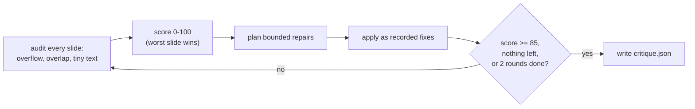

# Generation rules and the critique loop

## Two guarantees that never bend

1. **No invented facts.** Every word on every slide comes from your topic and
   notes, verbatim. The generator selects and arranges; it does not write new
   claims, numbers or quotes.
2. **No truncation.** If your text does not fit a slot's learned capacity, the
   excess is skipped with a warning, never silently shortened.

## From notes to a deck

`analyze_material()` sorts each note into headings, bullets, stats and quotes
(see the table in [cli.md](cli.md#note-formats-the-generator-understands)).
Anything that fits none of these, or that exceeds the learned word budget, goes
to `unusable` and is reported.

The `OutlineGenerator` then picks slide types and a concrete template for each,
using only types the material can actually fill. It opens with the learned
title template, schedules content slides from the material, prefers a closing
slide, and never places two identical layouts back to back. When fewer slides
can be planned than requested, the plan carries a warning naming the shortfall;
that warning is preserved in the final deck, so a short deck never looks like a
clean success.

The `ContentGenerator` fills each planned slide within the learned capacity -
how many bullets, how many words per bullet, how long a title may be. A stat
slide shows the value and context you supplied; a quote slide shows your text
and attribution. Material that does not fit is reported, not crammed in.

## The layout contract

`layout.plan_slide()` places each element in its template slot. Slot preference
is explicit: a subtitle prefers the template's `body` slot and falls back to
its `label` slot, so subtitle text lands where the source design puts it
instead of colliding with the learned title. Every box gets a stable element id
(`slide_02-title`, `slide_02-body-1`) reused as the shape name in the exported
file, so a later fix can target one element deterministically.

## The optional LLM path

With `--use-llm` (or `--use-llm` in the demo), Gemini drafts the outline and
the slide text. Every draft must pass the same validation as the deterministic
path: slide types must exist in the learned library, layouts must not repeat
back to back, capacity limits must hold, and every number, stat and quote must
appear in your own material. A rejected draft falls back to the deterministic
result with a warning that says why. Model output never reaches a deck
unvalidated.

## The critique loop

With `--critique`, the deck passes through `run_critique_loop()`:

- **Findings** are one of `overflow`, `overlap`, `tiny_font`, each with a
  severity of high, medium or low and the offending element id.
- **Repairs are bounded**: a box may grow or shift, a font may shrink in
  half-point steps down to the 12pt floor, and only once the font is at the
  floor may the longest bullet of a list be dropped - at most two per slide,
  always recorded with its exact text.
- **Wording is never changed**, and overlaps between two boxes are deliberately
  left alone, listed as unresolved for manual review.
- **Scoring**: each slide starts at 100 and loses points per finding by
  severity; the deck score is the worst slide's score, so one broken slide
  cannot be averaged away.
- **Stop conditions**: the threshold of 85 is met, no repair applies, or two
  iterations run out. A deck that still scores below the threshold is flagged
  for manual review.

With `--use-vision`, a Gemini visual critic also reviews each slide once from
the pre-critique render; its suggestions pass the same bounded-safety checks,
and where it and the deterministic planner propose a fix for the same element,
the deterministic one wins.

## What the loop will not do

It will not merge two overlapping boxes, rewrite text, move an element outside
the safe area, or shrink text below the floor. Those cases are reported with
before/after scores in `<name>_critique.json` and, where the threshold is
missed, the deck is flagged for you to finish by hand.
