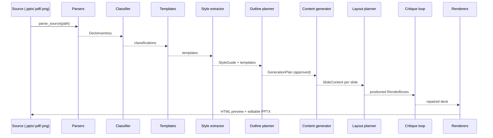

# Pipeline

This page walks one source through every stage, naming the real function called
and the real artifact written at each step. Stages 1-4 run in both the command
line tools and the web app; stages 5-9 are the generation half.

## Stage 1 - Parse

`core/source_parser.parse_source()` picks `DeckParser` (`.pptx`), `PdfParser`
(`.pdf`) or `RasterParser` (`.png` or folder of PNGs) and returns a
`DeckInventory`: one `SlideInventory` per slide, each holding `ShapeRecord`
objects with text runs, geometry normalised to a 1920px-wide canvas, colours,
and theme facts. Facts a source cannot carry stay absent with a warning.
Artifact: `output/raw_deck.json` (`scripts/parse_deck.py`, `scripts/demo.py`).

## Stage 2 - Classify

`SlideClassifier().classify_deck()` labels every slide with one of the 17 types
in the taxonomy (title, bullets, comparison, stat_callout, quote, and so on),
each with a human-readable reason and a confidence. First matching rule wins,
ordered from most structurally certain to weakest.

## Stage 3 - Learn templates

`build_templates(inventory, classifications)` turns each slide into a
`TemplateRecord`: a set of slots, each a role (title, body, stat, label, quote,
picture, and more) plus geometry as fractions of the canvas, so a template
applies at any resolution. Only top-level shapes become slots. Artifact:
`style_guides/<deck>_templates.json`.

## Stage 4 - Learn the style guide

`StyleGuideExtractor().extract()` derives the palette (with usage and
provenance), typography, margins, layout grid and content rules. PPTX sources
contribute native facts; PDF and PNG sources contribute measured pixel colours
tagged `measured` plus a warning, and their fonts stay unknown. Artifact:
`style_guides/<deck>.json`.

## Stage 5 - Plan the outline

`OutlineGenerator().plan(brief, templates, material)` selects slide types and a
concrete template for each, respecting the learned content limits and avoiding
back-to-back identical layouts. It uses only the learned template library, so it
is fast and deterministic; the web app plans synchronously. Material comes from
`analyze_material()`, which sorts the user's notes into headings, bullets, stats
and quotes.

## Stage 6 - Fill content

`ContentGenerator` (or, with `--use-llm`, a Gemini draft that must pass the same
validation) fills each planned slide using only the user's topic and notes. It
never invents facts; text that does not fit a slot's capacity is skipped with a
warning rather than truncated.

## Stage 7 - Layout

`layout.plan_slide(slide, template, style_guide)` places every element in its
template slot as a `RenderBox` with canvas-fraction geometry, a resolved font
and colour, and a stable element id such as `slide_02-body-1`. This is the one
layout path shared by both renderers.

## Stage 8 - Critique (optional)

`run_critique_loop()` audits the planned layout of every slide (overflow,
overlap, tiny text), scores each 0-100, plans a bounded set of repairs, applies
them as recorded fixes, and repeats for up to two iterations, stopping early at
the threshold of 85. Content wording is never changed. See
[generation-and-critique.md](generation-and-critique.md).

## Stage 9 - Render and export

`render_deck_html()` writes a self-contained HTML preview; `render_report()`
re-checks geometry against the same capacity estimators so overflow is reported
rather than hidden; `export_deck_pptx()` writes the editable PowerPoint file
with the same geometry, converting canvas fractions to EMU at 96px per inch.

## What the web app adds

The web app runs the identical stages inside background jobs so the browser can
show live progress and survive reloads: extraction runs Stages 1-4
(`app/extraction.py`), generation runs Stages 6-9 against the approved outline
(`app/generation.py`). The JSON API stays the single source of truth; the pages
only render and poll it.
