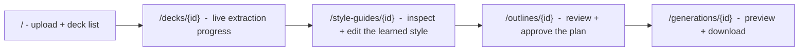

# Web app

The local web product runs the same pipeline as the command line behind a
small browser UI. Start it with:

```bash
python -m app.main        # then open http://127.0.0.1:8000
```

Everything runs and stays on the machine. A single background worker
(`app/jobs.py`) runs jobs strictly in submission order, and a SQLite store
(`app/db.py`) keeps stage, progress and results across page reloads, so
refreshing the browser (or restarting the server) never shows stale state.

## The five pages



| Page | Route | What it shows |
|---|---|---|
| Home | `/` | an upload form plus the recent decks with their status |
| Extraction progress | `/decks/{deck_id}` | the live stage ("Reading the slides", "Classifying slide types", ...) with a progress bar and any error |
| Style guide | `/style-guides/{style_guide_id}` | the learned palette, typography, margins and content rules, the template library, and the edit history |
| Outline | `/outlines/{outline_id}` | the proposed storyline with each slide's type, template and title, ready to approve |
| Generation | `/generations/{generation_id}` | live generation progress, then the HTML preview and download links |

The pages are server-rendered with small vanilla-JS polling. All real work
happens through the JSON API, which stays the single source of truth.

## JSON API reference

All endpoints live under `/v1`. Bodies are JSON unless noted. Ids use the
conventions in [data-model.md](data-model.md).

### POST /v1/decks

Upload a `.pptx`, `.pdf`, or `.png` source (multipart form field `file`) and
start learning its style. Limits: 64 MB, non-empty file, allowed suffix only.
Returns `202`:

```json
{ "deck_id": "deck_...", "status": "queued", "job_id": "job_..." }
```

### GET /v1/decks/{deck_id}

Extraction status and counts for one deck. Returns `deck_id`, `status`,
`source_name`, `slide_count`, `style_guide_id`, `template_count`, `error`,
timestamps, and an embedded `job` summary.

### GET /v1/jobs/{job_id}

Stage, progress and result for one background job. `result` holds the job's
output (for a generation job: `slide_count`, `generator`, `warnings`, a
`critique` summary, `artifacts`, and `output_url`).

### GET /v1/style-guides/{style_guide_id}

The learned style guide plus its edit history.

### PATCH /v1/style-guides/{style_guide_id}

Apply user overrides to fonts, palette, spacing or content limits. Patches are
merge-only: they change exactly the named values and are appended to an audit
trail; learned provenance is never rewritten. The guide file always holds the
current effective values.

### POST /v1/generations/outline

Plan a deterministic storyline from a topic and the learned templates.
Synchronous. Request fields:

| Field | Type | Notes |
|---|---|---|
| `topic` | string, 1-200 | required, non-blank |
| `style_guide_id` | string | required |
| `audience`, `goal` | string, up to 200 | optional |
| `tone` | string, up to 80 | optional |
| `notes` | list of string | up to 200 notes, each up to 500 characters |
| `slide_count` | int, 1-50 | default 5 |

Unknown fields are rejected (`extra="forbid"`). The response echoes
`deck_title`, `slide_count`, the `slides` (type, template, title per slide) and
any `warnings`, and stores the plan under an `outline_id` for approval.

### POST /v1/generations

Generate a deck from an approved outline as a background job. Request:
`style_guide_id`, `approved_outline_id`, optional `output_format` (`pptx`),
optional `enable_critique` (default `true`). Returns `202` with a
`generation_id`, `status: "queued"` and `job_id`. The stored outline is filled
exactly as approved, never re-planned.

### GET /v1/generations/{generation_id}/download/{artifact}

Download one finished artifact. `artifact` is one of:

| Artifact | File | Content type |
|---|---|---|
| `pptx` | `{gen}.pptx` | editable PowerPoint |
| `html` | `{gen}.html` | the self-contained preview |
| `json` | `{gen}.json` | the structured deck content |
| `critique` | `{gen}_critique.json` | the critique report |

Add `?inline=1` to render inline (the preview page embeds the HTML this way);
downloads default to attachment.

## Storage and limits

Runtime state lives only under gitignored directories (`app/config.py`):
uploads in `output/uploads/<deck_id>/`, generated decks in
`output/generated/<generation_id>/`, learned guides in `style_guides/`, and the
metadata database at `output/deckdna.sqlite3`. Uploaded file content is never
stored in the database - only identifiers, statuses, counts and artifact paths.
